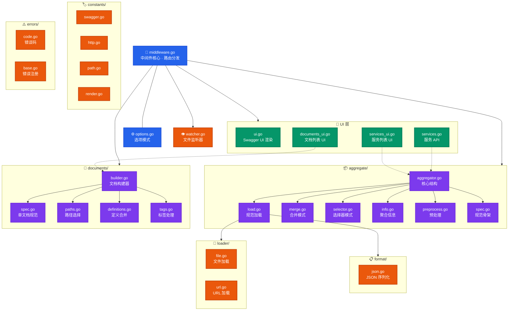

# go-swagger

功能强大的 Swagger 文档中间件库，支持单服务和多服务聚合模式，提供 Swagger UI 渲染、规范热重载和独立子文档管理

## 特性

- **双模式运行**：单服务模式直接加载规范文件，聚合模式合并多个微服务规范
- **聚合策略**：支持 Merge（合并）和 Selector（选择器）两种聚合模式
- **独立子文档**：按路径和方法粒度筛选，生成面向特定场景的 API 文档
- **文件热重载**：基于 fsnotify 实现规范文件变动自动重载，支持防抖
- **Swagger UI**：内置 CDN 版 Swagger UI，支持聚合/服务/文档三级导航
- **灵活加载**：支持本地文件（JSON/YAML）和远程 URL 两种规范来源
- **可扩展**：支持自定义错误响应、日志记录和选项配置

## 框架图



## 目录结构

```bash
go-swagger/
├── aggregate/           # 聚合模块
│   ├── aggregator.go    # 核心结构、构造函数、模式分发
│   ├── load.go          # 服务规范加载（文件/URL 双源）
│   ├── merge.go         # 合并模式
│   ├── selector.go      # 选择器模式
│   ├── spec.go          # 规范骨架、引用修复
│   ├── info.go          # 聚合信息构建（info/contact/license/services）
│   └── preprocess.go    # 预处理（BasePath 更新、标签注入）
├── constants/           # 常量模块（按领域拆分）
│   ├── swagger.go       # Swagger 规范常量（版本、字段名、聚合模式）
│   ├── http.go          # HTTP 常量（请求头、CORS、MIME、文件扩展名）
│   ├── path.go          # 路径常量（路由路径、分隔符）
│   └── render.go        # 渲染常量（HTML、UI 配置、JSON 序列化、调试字段）
├── documents/           # 独立子文档模块
│   ├── builder.go       # Builder 结构、构造函数、文档构建入口
│   ├── spec.go          # 单文档规范构建、info 字段、顶层字段合并
│   ├── paths.go         # 路径选择（include/exclude 筛选）
│   ├── definitions.go   # 定义递归合并、引用收集
│   └── tags.go          # 标签去重、操作标签收集
├── errors/              # 错误模块
│   ├── code.go          # 错误码定义（中间件 7000-7099、加载器 7100-7199）
│   └── base.go          # 错误注册（init 注册所有错误消息模板）
├── format/              # 格式化模块
│   └── json.go          # 规范 JSON 序列化
├── loader/              # 加载器模块（只负责加载）
│   ├── file.go          # 文件加载（JSON/YAML 自动检测）
│   └── url.go           # URL 加载（HTTP/HTTPS 远程加载）
├── middleware.go         # 中间件核心（结构定义、Handler 路由分发）
├── options.go           # 选项模式
├── services.go          # 服务 API（JSON 响应、调试端点）
├── services_ui.go       # 服务列表 UI
├── documents_ui.go      # 文档列表 UI
├── ui.go                # Swagger UI 渲染
└── watcher.go           # 文件监听器
```

## 安装

```bash
go get github.com/kamalyes/go-swagger
```

## 模块依赖

本库依赖以下核心模块：

- `github.com/kamalyes/go-config` - 配置管理，提供 Swagger 配置结构
- `github.com/kamalyes/go-logger` - 日志记录，支持自定义日志器
- `github.com/kamalyes/go-toolbox` - 工具集，包含错误处理、类型转换等工具
- `github.com/fsnotify/fsnotify` - 文件系统监听，实现热重载功能
- `gopkg.in/yaml.v3` - YAML 解析，支持 YAML 格式的 Swagger 规范

## 基本用法

### 1. 单服务模式

```go
import (
    goswagger "github.com/kamalyes/go-config/pkg/swagger"
    swaggerMiddleware "github.com/kamalyes/go-swagger"
)
    config := goswagger.Default()
    config.Enabled = true
    config.SpecPath = "./api/swagger.json"  // 或 config.YamlPath = "./api/swagger.yaml"
    config.UIPath = "/swagger"
    middleware, err := swaggerMiddleware.NewMiddleware(config,
        swaggerMiddleware.WithLogger(myLogger),
    )
    if err != nil {
        log.Fatal(err)
    }
    // 作为 HTTP 中间件使用
    handler := middleware.Handler()
    http.Handle("/", handler(existingHandler))
    // 或独立提供 Swagger 服务
    http.Handle("/swagger/", middleware)
```

### 2. 聚合模式 - Merge

将多个微服务的 Swagger 规范合并为统一文档：

```go
config := goswagger.Default()
config.Enabled = true
config.UIPath = "/swagger"
config.Aggregate.Enabled = true
config.Aggregate.Mode = "merge"
config.Aggregate.Services = []*goswagger.ServiceSpec{
    {
        Name:     "UserService",
        SpecPath: "./specs/user.swagger.json",
        Enabled:  true,
        BasePath: "/api/user",
        Tags:     []string{"用户服务"},
    },
    {
        Name:     "OrderService",
        URL:      "http://order-service:8080/swagger/doc.json",
        Enabled:  true,
        BasePath: "/api/order",
        Tags:     []string{"订单服务"},
    },
}
middleware, _ := swaggerMiddleware.NewMiddleware(config)
```

### 3. 聚合模式 - Selector

按服务名选择查看规范：

```go
config.Aggregate.Mode = "selector"
// 其余配置同 Merge 模式
```

### 4. 独立子文档

按路径和方法粒度筛选，生成面向特定场景的 API 文档：

```go
config.Aggregate.Documents = []*goswagger.DocumentSpec{
    {
        Name:        "open-api",
        Title:       "开放平台 API",
        Description: "面向外部开发者的 API 文档",
        Version:     "1.0.0",
        Enabled:     true,
        Sources: []*goswagger.DocumentSource{
            {
                Service: "UserService",
                Include: []*goswagger.DocumentPathSelector{
                    {Path: "/v1/users/register"},
                    {Path: "/v1/users/login"},
                },
            },
            {
                Service: "OrderService",
                Exclude: []*goswagger.DocumentPathSelector{
                    {Path: "/v1/orders/internal", Methods: []string{"GET", "POST"}},
                },
            },
        },
    },
}
```

### 5. 文件热重载

```go
// 启用文件监听
if err := middleware.EnableFileWatcher(); err != nil {
    log.Printf("启用文件监听失败: %v", err)
}
// 停用文件监听
middleware.DisableFileWatcher()
// 查看监听状态
fmt.Println(middleware.IsWatcherRunning())
fmt.Println(middleware.FormatWatchPaths())
```

### 6. 自定义选项

```go
middleware, _ := swaggerMiddleware.NewMiddleware(config,
    swaggerMiddleware.WithLogger(myLogger),
    swaggerMiddleware.WithErrorResponseFunc(func(w http.ResponseWriter, httpStatus int, message string) {
        w.Header().Set("Content-Type", "application/json")
        w.WriteHeader(httpStatus)
        json.NewEncoder(w).Encode(map[string]string{
            "error": message,
        })
    }),
)
```

### 7. 动态更新配置

```go
newConfig := goswagger.Default()
newConfig.Enabled = true
newConfig.Aggregate.Enabled = true
newConfig.Aggregate.Services = newServices
if err := middleware.UpdateConfig(newConfig); err != nil {
    log.Printf("更新配置失败: %v", err)
}
```

## 路由结构

| 路径                          | 说明                           |
| --------------------------- | ---------------------------- |
| `{UIPath}`                  | Swagger UI 首页                |
| `{UIPath}/swagger.json`     | 规范 JSON（单服务模式）或聚合 JSON（聚合模式） |
| `{UIPath}/services`         | 服务列表页（聚合模式）                  |
| `{UIPath}/services/{name}`  | 单个服务 Swagger UI（聚合模式）        |
| `{UIPath}/documents`        | 独立文档列表页（聚合模式）                |
| `{UIPath}/documents/{name}` | 独立文档 Swagger UI（聚合模式）        |
| `{UIPath}/aggregate.json`   | 聚合信息 JSON（聚合模式）              |
| `{UIPath}/debug/services`   | 调试信息 JSON（聚合模式）              |

## API 文档

### 主要方法

#### NewMiddleware

创建新的 Swagger 中间件实例

```go
func NewMiddleware(config *goswagger.Swagger, opts ...Option) (*Middleware, error)
```

#### 中间件方法

- `Handler() func(http.Handler) http.Handler` - 返回 HTTP 中间件函数
- `ServeHTTP(w http.ResponseWriter, r *http.Request)` - 实现 http.Handler 接口
- `UpdateConfig(config *goswagger.Swagger) error` - 动态更新配置
- `EnableFileWatcher() error` - 启用文件监听器
- `DisableFileWatcher()` - 停用文件监听器
- `IsWatcherRunning() bool` - 检查监听器状态

#### 聚合模式方法

- `IsAggregateEnabled() bool` - 检查聚合模式是否启用
- `GetServiceSpec(serviceName string) ([]byte, error)` - 获取单个服务规范
- `GetDocumentSpec(documentName string) ([]byte, error)` - 获取独立文档规范
- `GetAggregatedSpec() ([]byte, error)` - 获取聚合规范

### 选项配置

#### WithLogger

设置自定义日志器

```go
func WithLogger(l logger.ILogger) Option
```

#### WithErrorResponseFn

设置自定义错误响应函数

```go
func WithErrorResponseFn(fn ErrorResponseFunc) Option
```

## 错误处理

库使用 `github.com/kamalyes/go-toolbox/pkg/errorx` 进行错误处理，支持错误类型注册和格式化消息。主要错误类型包括：

- `ErrTypeConfigNil` (7000) - 配置不能为空
- `ErrTypeAggregateDisabled` (7001) - 聚合功能未启用
- `ErrTypeServiceNotFound` (7003) - 服务不存在
- `ErrTypeDocumentNotFound` (7004) - 文档不存在
- `ErrTypeLoadFailed` (7010) - 加载规范失败
- `ErrTypeAggregateFailed` (7011) - 聚合规范失败
- `ErrTypeWatcherStartFailed` (7013) - 启动文件监听器失败

## 测试

```bash
go test -cover ./... -v
```

## 📄 许可证

Copyright (c) 2026 kamalyes. All Rights Reserved.
